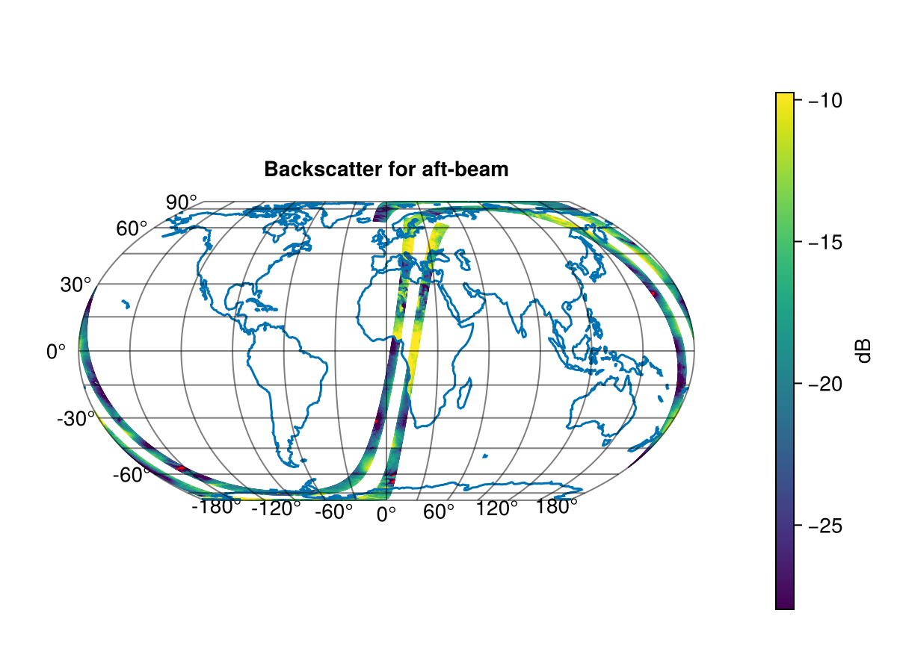
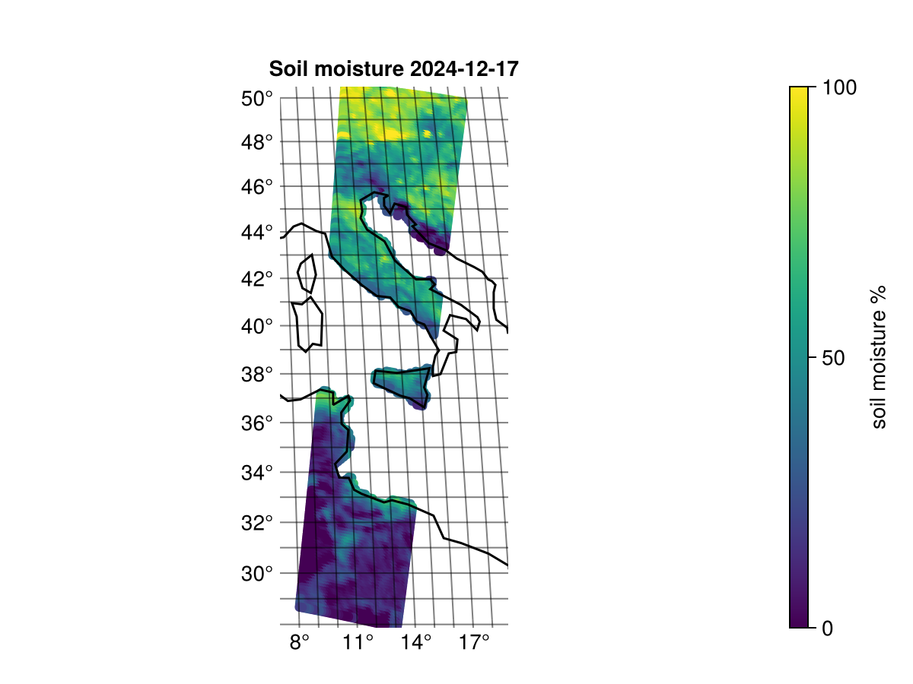

## ASCAT

The Advanced Scatterometer (ASCAT) is an instrument on the METOP satellites. It is a fixed beam C-band scatterometer with 6 antenna beams used to retrieve wind vectors over the ocean and soil moisture over the land. The level 1 products are normalised backscatter coefficients (sigma0) that the instrument measures directly. The level 2 products are soil moisture and wind vectors derived from the backscatter. The wind vector product does not use the native binary format so they are not described further here. It should be noted that the winds are available as NetCDF.
For more information see [ASCAT User Guide](https://user.eumetsat.int/s3/eup-strapi-media/ASCAT_User_Guide_1618a3d741.pdf)

All data used in examples are available from [EUMETSAT data store](https://data.eumetsat.int/extended?query=&filter=instrument__ASCAT&filter=availableFormats__Native)

## SZF beam statistics
The level 1B SZF files contain full resolution backscatter from the 6 antenna beams. See the [ASCAT level 1B SZF product page](https://data.eumetsat.int/product/EO:EUM:DAT:METOP:ASCSZF1B) for more information.  
This example shows how we can get the 5% and 95% quantile of the backscatter from each beam only considering the observations with no flags. It should be noted that observations over land are are flagged with a land-flag so theses statistics only consider oceans.

Read and inspect the variables:
```julia
using MetopDatasets, Statistics
ds = MetopDataset("ASCA_SZF_1B_M03_20241217091500Z_20241217105659Z_N_O_20241217105652Z.nat")

# Read arrays immediately
beam_numbers = Array(ds["beam_number"])
sigma0 = Array(ds["sigma0_full"])
flags = Array(ds["flagfield"])

@show size(beam_numbers)
@show size(sigma0)
@show size(flags)

no_flags = flags .== 0 
println("Number of observations with no flag: ", sum(no_flags))
```
REPL output:
```
size(beam_numbers) = (43236,)
size(sigma0) = (192, 43236)  
size(flags) = (192, 43236)
Number of observations with no flag: 5948489
```
We can see that `beam_numbers` only have 1 dimension but `sigma0` and `flags` have two. This is because there is only one beam number per data record but each data record contain a line with 192 observations across the swath. 
Printing the quantiles for each beam.
```julia
for i in 1:6 # same as `i in sort(unique(beam_numbers))`
    in_beam = beam_numbers .== i
    sigma0_beam = sigma0[:, in_beam]
    no_flags_beam = no_flags[:, in_beam]

    sigma_q05 = quantile(sigma0_beam[no_flags_beam],0.05)
    sigma_q95 = quantile(sigma0_beam[no_flags_beam],0.95)

    rounded_range = round.((sigma_q05,sigma_q95); digits=2) 

    println("Beam: ", i, ", Sigma0 (q05,q95) range: ", rounded_range )
end
```
REPL output:
```
Beam: 1, Sigma0 (q05,q95) range: (-29.84, -12.31)
Beam: 2, Sigma0 (q05,q95) range: (-27.22, -5.63)
Beam: 3, Sigma0 (q05,q95) range: (-29.94, -12.76)
Beam: 4, Sigma0 (q05,q95) range: (-28.75, -12.96)
Beam: 5, Sigma0 (q05,q95) range: (-25.5, -5.2)
Beam: 6, Sigma0 (q05,q95) range: (-28.4, -12.02)
```
We can now see the sigma0 quintile ranges for each beam.

## SZR and SZO plot
The level 1B SZR files contain backscatter values from the 6 ASCAT beams, resampled to a common 12.5 x 12.5 km grid. There are three beams imaging each side of the satellite so this results in 3 backscatter measurements for each grid point. The level 1B SZO files are identical but resampled to a 25 x 25 km grid instead. See [ASCAT level 1B SZR product page](https://data.eumetsat.int/product/EO:EUM:DAT:METOP:ASCSZR1B) and [ASCAT level 1B SZO product page](https://data.eumetsat.int/product/EO:EUM:DAT:METOP:ASCSZO1B) for more information.

These examples will work to both plot SZR and SZO data. The examples are made using the following packages.
```
[13f3f980] CairoMakie v0.12.16
[db073c08] GeoMakie v0.7.9
```
Note that the plot can become interactive by replacing CarioMakie with GLMakie. See [Makie documentation](https://docs.makie.org/) for more information on plotting.
### Global plot of SZR or SZO
This example plots the backscatter from and entire orbit. The backscatter is just plotted for one beam direction. 
```julia
using MetopDatasets
using CairoMakie, GeoMakie, Statistics

# Open the dataset
ds = MetopDataset("ASCA_SZR_1B_M01_20241217081500Z_20241217095658Z_N_O_20241217090832Z.nat", maskingvalue=NaN);

# Select which beam to plot 
beam_names = ["fore-beam", "mid-beam", "aft-beam"]
beam_index = 3

# read variables for beam
latitude = Array(ds["latitude"])
longitude = Array(ds["longitude"])
sigma0 = ds["sigma0_trip"][beam_index,:,:]
usable_flag = ds["f_usable"][beam_index,:,:]

# change longitude to be -180 to 180
longitude[longitude .> 180] .-= 360

# check flags
usable = usable_flag .!= 2

# get sigma0 ranges
sigma_q05 = quantile(sigma0[usable],0.05)
sigma_q95 = quantile(sigma0[usable],0.95)

# plot the data
fig = let

    # Create figure and axis
    fig = Figure()
    ax = GeoAxis(fig[1, 1],
        title = "Backscatter for " * beam_names[beam_index],
        xlabel = "longitude",
        ylabel = "latitude")

    # plot "good" and "usable" data with color map
    scatter!(ax, longitude[usable], latitude[usable],
        color = sigma0[usable], colorrange = (sigma_q05,sigma_q95), markersize = 1)

    # plot "bad" data as red
    scatter!(ax, longitude[.!usable], latitude[.!usable],
        color = :red, markersize = 1)

    # Add colorbar
    Colorbar(fig[1,2], colorrange = (sigma_q05,sigma_q95), label="dB")

    # Add coastlines
    lines!(ax, GeoMakie.coastlines()) 
    fig
end
```


The plot shows the left and right swath ASCAT mapped for an orbit. 


### Plotting a subset of SZR or SZO
This example shows how to plot the backscatter for a small subset of the SZR product.
```julia
using MetopDatasets
using CairoMakie, GeoMakie, Statistics

ds = MetopDataset("ASCA_SZR_1B_M01_20241217081500Z_20241217095658Z_N_O_20241217090832Z.nat", maskingvalue=NaN);

# Select subset record subset to plot
record_subset = 150:350

# define the two swaths. 
grid_nodes = ds.dim["xtrack"]
swath_width = div(grid_nodes,2)
left_swath = 1:swath_width
right_swath = (swath_width+1):grid_nodes

# read variables for right_swath of the subset.
latitude = ds["latitude"][right_swath, record_subset]
longitude = ds["longitude"][right_swath, record_subset]
sigma0 = ds["sigma0_trip"][:, right_swath, record_subset]
usable_flag = ds["f_usable"][:, right_swath, record_subset]

# change longitude to be -180 to 180
longitude[longitude .> 180] .-= 360

# check flags
usable = usable_flag .!= 2

# get sigma0 ranges
sigma_q05 = quantile(sigma0[usable],0.05)
sigma_q95 = quantile(sigma0[usable],0.95)

# plot the data
beam_names = ["fore-beam", "mid-beam", "aft-beam"]
fig = let    
    fig = Figure()

    # plot each beam
    for i in 1:3
        sigma_i = sigma0[i,:,:]
        usable_i = usable[i,:,:]

        # Create new axis
        ax = GeoAxis(fig[1, i],
            title = beam_names[i],
            xlabel = "longitude",
            ylabel = "latitude",
            limits = (extrema(longitude), extrema(latitude))
            )

        # plot "good" and "usable" data with color map
        scatter!(ax, longitude[usable_i], latitude[usable_i],
            color = sigma_i[usable_i], colorrange = (sigma_q05,sigma_q95), markersize = 6)
        
        # plot "bad" data as red
        scatter!(ax, longitude[.!usable_i], latitude[.!usable_i],
            color = :red, markersize = 6)

        # add coastlines
        lines!(ax, GeoMakie.coastlines(), color=:black) 
    end

    # add colorbar
    Colorbar(fig[1,4], colorrange = (sigma_q05,sigma_q95), label="dB")

    fig
end
```


The subset shows the measured backscatter from the right swath over the mediterranean and across Italy. The red spots shows the measurements flagged as "bad". This is probably caused by radio frequency interference from ground equipment resulting in a low signal-to-noise ratio.

## Soil moisture example
The ASCAT Level 2 SMR product contains relative soil moisture on a 12.5 x 12.5 km grid. The SMO product is identical but resampled to a 25 x 25 km grid instead.
See [ASCAT level 2 SMR product page](https://data.eumetsat.int/product/EO:EUM:DAT:METOP:SOMO12) and [ASCAT level 2 SMO product page](https://data.eumetsat.int/product/EO:EUM:DAT:METOP:SOMO25) for more information.

These examples will work to plot both SMR and SMO data. The examples are made using the following packages.
```
[13f3f980] CairoMakie v0.12.16
[db073c08] GeoMakie v0.7.9
```
### Plotting a subset of SMR or SMO
This example shows how to plot the soil moisture for from a SMR or SMO product.
```julia
using MetopDatasets
using CairoMakie, GeoMakie, Dates

ds = MetopDataset("ASCA_SMR_02_M01_20241217081500Z_20241217095658Z_N_O_20241217090845Z.nat", maskingvalue=NaN);

# Select subset record subset to plot
record_subset = 150:350

# define the two swaths. 
grid_nodes = ds.dim["xtrack"]
swath_width = div(grid_nodes,2)
left_swath = 1:swath_width
right_swath = (swath_width+1):grid_nodes

# get sensing date
sensing_date = Date(DateTime(ds.attrib["sensing_start"]))

# read variables for right_swath of the subset.
latitude = ds["latitude"][right_swath, record_subset]
longitude = ds["longitude"][right_swath, record_subset]
soil_moisture = ds["soil_moisture"][right_swath, record_subset]

# change longitude to be -180 to 180
longitude[longitude .> 180] .-= 360

fig = let    
    fig = Figure()

    # Create new axis
    ax = GeoAxis(fig[1, 1],
        title = "Soil moisture $(sensing_date)",
        xlabel = "longitude",
        ylabel = "latitude",
        limits = (extrema(longitude), extrema(latitude))
        )

    # plot with scatter
    scatter!(ax, longitude[:], latitude[:], color=soil_moisture[:], colorrange=(0.0,100.0))

    # add coastlines
    lines!(ax, GeoMakie.coastlines(), color=:black) 
 
    # add colorbar
    Colorbar(fig[1,2], colorrange = (0.0,100.0), label="soil moisture %")

    fig
end
```

The plot shows the retrieved soil moisture. The filtering on flags in this example is very rough. It might be good to have a close look at the individual flag variables depending on the application.