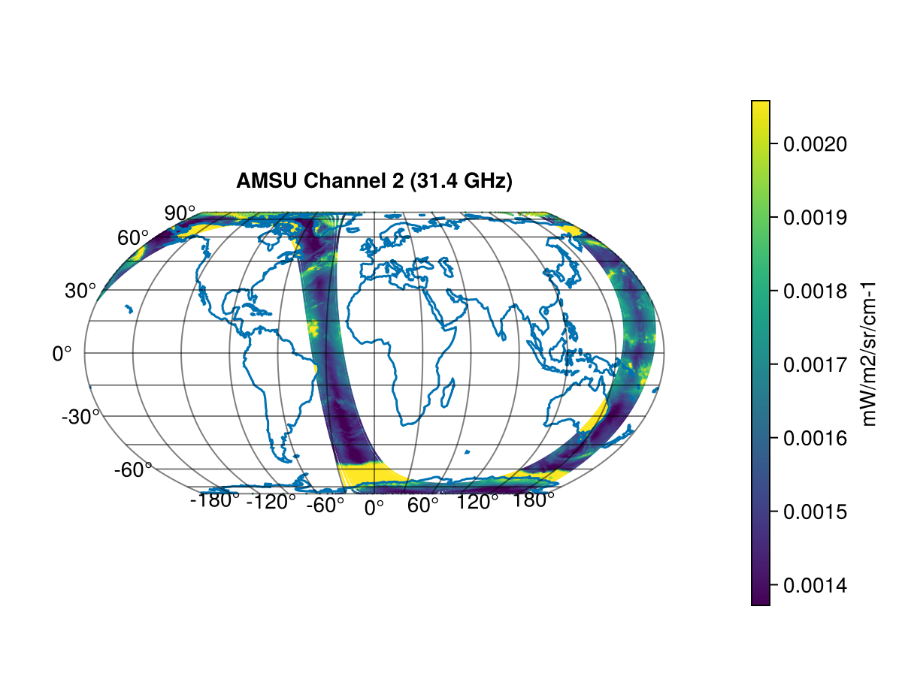
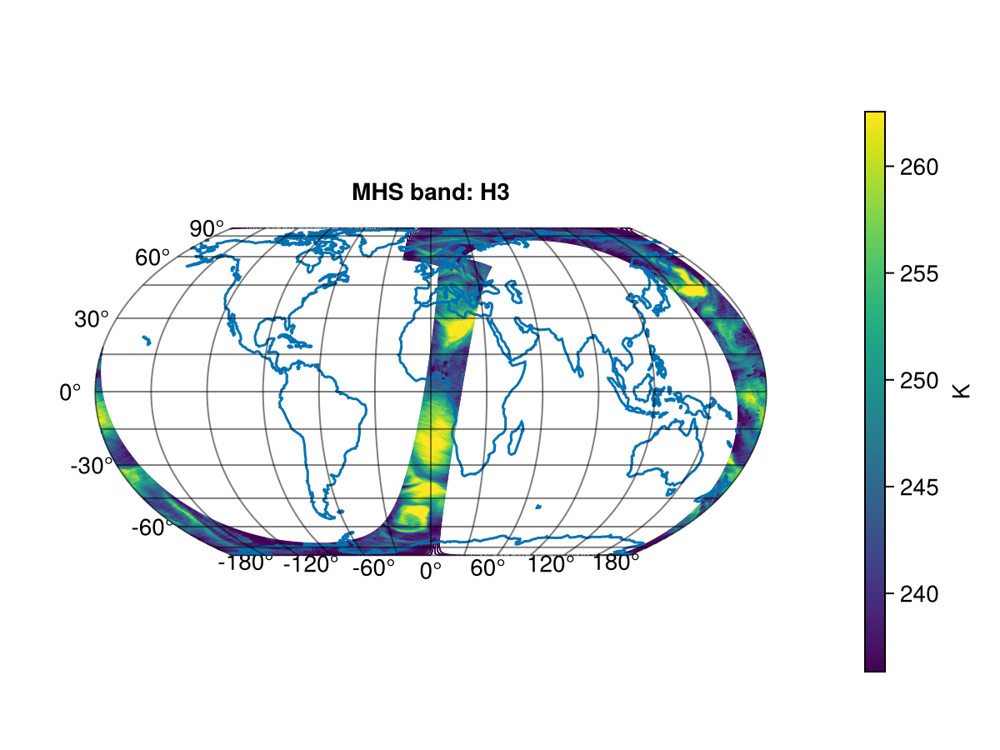

## ATOVS
Advanced TIROS Operational Sounder (ATOVS) is a sounding instrument package. The ATOVS instruments have both been flown on NOAA satellites and on the METOP satellites. The METOP ATOVS instrument package consists of 3 sensors:
- Advanced Microwave Sounding Units A (AMSU-A)
- High Resolution InfraRed Sounder (HIRS)
- Microwave Humidity Sounder (MHS)
For more information see [ATOVS Level 1b Product Guide](https://user.eumetsat.int/s3/eup-strapi-media/pdf_atovsl1b_pg_8bbaa8ba48.pdf)

## AMSU-A
The Advanced Microwave Sounding Unit-A (AMSU-A) is an instrument on the METOP satellites. AMSU-A is a microwave radiometer with 15 channels and is one of the three ATOVS sensors.

The AMSU-A L1B products contain the radiance measured at all 15 channels. See the [AMSU-A Level 1B product pagel](https://user.eumetsat.int/catalogue/EO:EUM:DAT:METOP:AMSUL1) for more information. The frequency of each channel is given in [NOAA KLM User's Guide](https://web.archive.org/web/20060420075941/http://www2.ncdc.noaa.gov/docs/klm/html/c3/sec3-3.htm)

This example is made using the following packages.
```
[13f3f980] CairoMakie v0.15.6
[db073c08] GeoMakie v0.7.15
```

```julia
using MetopDatasets
using CairoMakie, GeoMakie, Statistics

# Open the dataset.
path = "AMSA_xxx_1B_M03_20250915221320Z_20250915235520Z_N_O_20250915235036Z.nat"
ds = MetopDataset(path, maskingvalue=NaN);

# read location
latitude = ds["earth_location"][1,:,:]
longitude = ds["earth_location"][2,:,:]

# read radiance
radiance_of_band = ds["scene_radiance"][2,:,:] # Channel 2 is 31.4 GHz

radiance_q05 = quantile(radiance_of_band[:],0.05)
radiance_q90 = quantile(radiance_of_band[:],0.90)

fig = let
    # Create figure and axis
    fig = Figure()
    ax = GeoAxis(fig[1, 1],
        title = "AMSU",
        xlabel = "longitude",
        ylabel = "latitude")

    # plot data with color map
        scatter!(ax, longitude[:], latitude[:],
        color = radiance_of_band[:], colorrange = (radiance_q05,radiance_q90), markersize = 2)

    # Add colorbar
    Colorbar(fig[1,2], colorrange = (radiance_q05,radiance_q90) , label="mW/m2/sr/cm-1")

    # Add coastlines
    lines!(ax, GeoMakie.coastlines()) 
    fig
end
```

The plot shows the radiance for the AMSU-A channel 2 (31.4 GHz) observed during an orbit.

## HIRS
The High Resolution Infrared Sounder (HIRS) is an instrument on the METOP satellites. It is a 20 channel infrared sounder and one of the three Advanced TIROS Operational Sounder (ATOVS) sensors. 

The level 1B HIRS files contain the radiance of the 19 channels and the reflectance for channel 20.  See the [HIRS Level 1B product page](https://user.eumetsat.int/catalogue/EO:EUM:DAT:MULT:HIRSL1) for more information.  
This example shows how we plot the radiance from channel 7 on a map.

This example is made using the following packages.
```
[13f3f980] CairoMakie v0.15.6
[db073c08] GeoMakie v0.7.15
```

```julia
using MetopDatasets
using CairoMakie, GeoMakie, Statistics

# Open the dataset.
path = "HIRS_xxx_1B_M01_20160720074253Z_20160720092153Z_N_O_20160720083048Z.nat"
ds = MetopDataset(path, maskingvalue=NaN);

# read location
latitude = ds["earth_location"][1,:,:]
longitude = ds["earth_location"][2,:,:]

# read radiance
radiance_of_band = ds["digital_a_rad"][7,:,:] # Channel 7

radiance_q05 = quantile(radiance_of_band[.!isnan.(radiance_of_band)],0.05)
radiance_q95 = quantile(radiance_of_band[.!isnan.(radiance_of_band)],0.95)

fig = let
    # Create figure and axis
    fig = Figure()
    ax = GeoAxis(fig[1, 1],
        title = "HIRS Channel 7",
        xlabel = "longitude",
        ylabel = "latitude")

    # plot data with color map
        scatter!(ax, longitude[:], latitude[:],
        color = radiance_of_band[:], colorrange = (radiance_q05,radiance_q95), markersize = 2)

    # Add colorbar
    Colorbar(fig[1,2], colorrange = (radiance_q05,radiance_q95))

    # Add coastlines
    lines!(ax, GeoMakie.coastlines()) 
    fig
end
```


## MHS
The Microwave Humidity Sounder (MHS) is an instrument on the METOP satellites. It measures the earth using 5 microwave channels sensitive to surface temperatures, emissivities, and atmospheric humidity. MHS is one of the three Advanced TIROS Operational Sounder (ATOVS) sensors.

The level 1B MHS files contain the radiance of the 5 channels. See the [MHS Level 1B product page](https://user.eumetsat.int/catalogue/EO:EUM:DAT:METOP:MHSL1) for more information.  
This example shows how we compute the brightness temperature of channel 3 and plot it on a map. Note that `scene_radiances` can also be plotted directly and this will result in a very similar image but with a different color range. 

This example is made using the following packages.
```
[13f3f980] CairoMakie v0.15.6
[db073c08] GeoMakie v0.7.15
```

```julia

using MetopDatasets
using CairoMakie, GeoMakie, Statistics

# Open the dataset.
path = "MHSx_xxx_1B_M03_20250915084851Z_20250915103051Z_N_O_20250915102514Z.nat"
ds = MetopDataset(path, maskingvalue=NaN);

# select band to plot: 1,2,3,4 or 5
band_to_plot = 3

# read location
latitude = ds["earth_location"][1,:,:]
longitude = ds["earth_location"][2,:,:]

# read radiance
radiance_of_band = ds["scene_radiances"][band_to_plot,:,:]

## convert radiance to brightness temperature.

# get wave number of channel
mhs_giadr = read_first_record(ds, MetopDatasets.GIADR_MHS_RADIANCE)
wave_number_cm = get_scaled(mhs_giadr, "central_wavenumber_h$(band_to_plot)")

# covert wave number from cm^-1 to m^-1
wave_number_SI = 10.0^2 * wave_number_cm

# covert radiance from mW/m2/sr/cm-1 to W/m2/sr/m-1
radiance_SI = radiance_of_band * 10^(-5)

T_brightness_uncorrected = brightness_temperature.(radiance_SI, wave_number_SI)

# Apply linear corrections to the brightness temperature
a_correction = get_scaled(mhs_giadr, "temperature_h$(band_to_plot)_intercept")
b_correction = get_scaled(mhs_giadr, "temperature_h$(band_to_plot)_slope")
T_brightness = a_correction .+ T_brightness_uncorrected .* b_correction

# Plot the correct brightness temperature
T_brightness_q05 = quantile(T_brightness[:],0.05)
T_brightness_q95 = quantile(T_brightness[:],0.95)

fig = let
    # Create figure and axis
    fig = Figure()
    ax = GeoAxis(fig[1, 1],
        title = "MHS band: H$(band_to_plot)",
        xlabel = "longitude",
        ylabel = "latitude")

    # plot data with color map
    scatter!(ax, longitude[:], latitude[:],
        color = T_brightness[:], colorrange = (T_brightness_q05,T_brightness_q95), markersize = 1)

    # Add colorbar
    Colorbar(fig[1,2], colorrange = (T_brightness_q05,T_brightness_q95), label="K")

    # Add coastlines
    lines!(ax, GeoMakie.coastlines()) 
    fig
end
```

The plot shows the brightness temperature for the MHS H3 channel (183.311 GHz) observed during an orbit.


