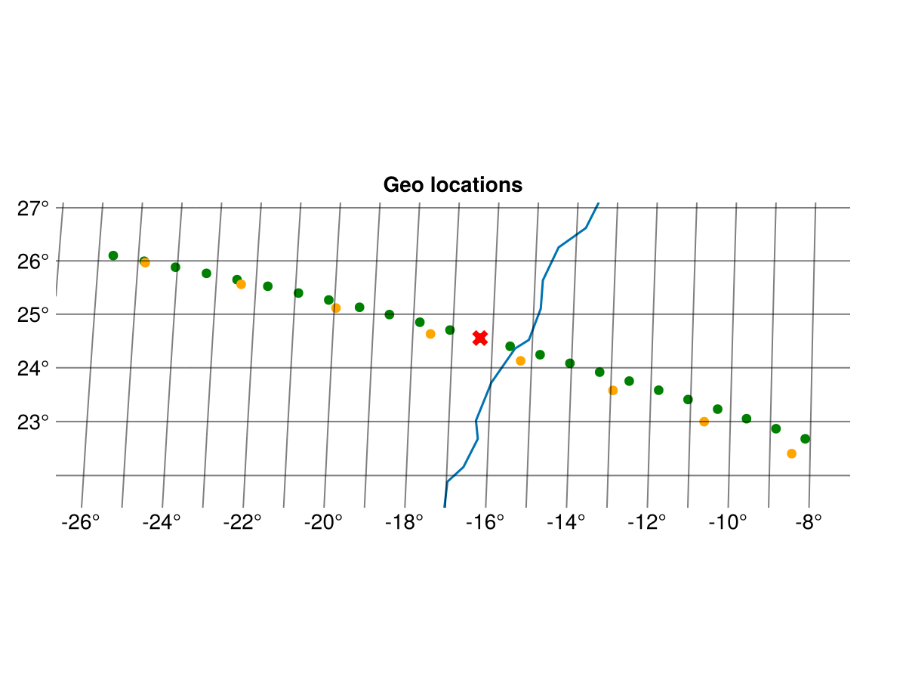
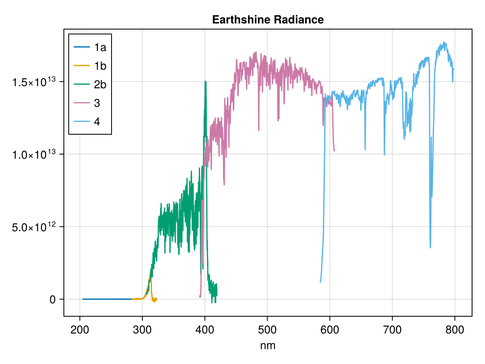
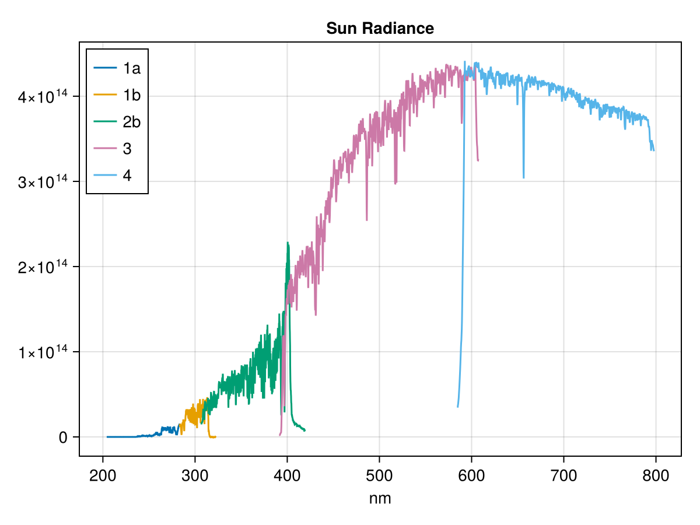

## GOME-2

The Global Ozone Monitoring Experiment-2 (GOME-2) is a nadir-scanning UV/visible spectrometer on the MetOp satellites. It measures Earth-backscattered radiance in the 240–790 nm wavelength range across six main spectral bands (1a, 1b, 2a, 2b, 3, 4) and four Polarisation Measurement Device (PMD) bands (pp, ps, swpp, swps). The Level 1B product contains calibrated radiance spectra and associated geolocation data.

GOME-2 data is available from the [EUMETSAT Data Store](https://data.eumetsat.int/extended?query=&filter=instrument__GOME-2&filter=availableFormats__EPS%20Native).

Two format versions are supported:
- **V13** (NRT products): format\_major\_version 13, subclass version 6
- **V12** (FDR R3 reprocessed products): format\_major\_version 12, subclass version 5

The product contains up to four MDR subclasses with different binary layouts: Earthshine (subclass 6), Calibration (7), Sun (8) and Moon (9). Earthshine records carry the nadir-scan measurements and are always present. Sun and Calibration records appear in granules covering the once-per-day solar calibration sequence, and Moon records only during the ~monthly lunar calibration campaigns.

### Opening a dataset

Opening a GOME-2 L1B product returns a root dataset where each MDR subclass present in the file is exposed as a group. The root itself only carries the global attributes.

```julia
using MetopDatasets
import CommonDataModel as CDM

ds = MetopDataset("GOME_xxx_1B_M03_20260514104157Z_20260514122057Z_N_O_20260514121923Z.nat", maskingvalue=NaN);

println("version: ", ds.attrib["format_major_version"])
println("subclasses: ", keys(ds.group))
```
output: 
```
version: 13
subclasses: ["earthshine", "calibration", "sun"]
```

The examples below use the earthshine group:

```julia
ds_earthshine = ds.group["earthshine"]
```

### Geolocation

Latitude and longitude are extracted from the interleaved CENTRE field. Each scan line has 32 ground pixels with geolocation. The second dimension of each spectral band corresponds to the number of readouts per scanline. In the cases where the number of readouts are 32, each spectral measurement simply corresponds to a ground pixel location. In the cases with fewer readouts, e.g. 4 per scan line, the ground pixels should be downsampled to 4 points using an appropriate method. When a band has more than 32 readouts, often PMD bands, then the ground pixels should be upsampled instead. 

```julia
data_record_index = 105 # select a scanline/data_record

lat = ds_earthshine["latitude"][:, data_record_index]  # 32 latitudes from the scan line 
lon = ds_earthshine["longitude"][:, data_record_index]  # 32 latitudes from the scan line 

main_bands = ("1a","1b","2b","3","4") # we skip 2a.
for band_name in main_bands
    n_readouts = ds_earthshine["num_recs_"*band_name][data_record_index]
    println("$band_name : $n_readouts readouts per scanline")
end
```

Multiple geolocation fields are available in the dataset `centre`, `corner`, `scan_centre`, `scan_corner` and `sub_satellite_point`.

Here is an example of plotting the ground pixel for a scan line. 

```julia
selected_obs = 12

# Plot figure
fig = let
    fig = Figure()
    # axis to plot geolocation
    ax = GeoAxis(fig[1, 1],
        title = "Geo locations",
        xlabel = "longitude",
        ylabel = "latitude",
        limits = (extrema(lon) .+ (-1,1), extrema(lat).+ (-1,1)))

    forward_scan = 1:24
    back_scan = 25:32
    # plot all observations from data record in gray
    scatter!(ax, lon[forward_scan], lat[forward_scan], color=:green)
    scatter!(ax, lon[back_scan], lat[back_scan], color=:orange)
    # plot selected observations in color
    scatter!(ax, lon[[selected_obs]], lat[[selected_obs]], 
        color=:red, marker=:xcross, markersize = 15)

    # Add coastlines
    lines!(ax, GeoMakie.coastlines()) 
    save("GOME2_scanline.png",fig)
    fig
end
```

The figure above shows the ground pixels for a scanline. The pixels from the forward scan are shown in green and for the back scan in orange. The blue line shows the coast line. The red point is the pixel selected to be visualised in the next example.

### Spectral variables

The main observations in the product are the radiances of the main bands and their wavelength. The stokes fraction based on the PMD measurements are included to correct the radiances. The raw PMD measurements are also provided for advanced users.  

Each band provides:
- `wavelength_{band}` — wavelength grid in nm
- `radiance_{band}` — calibrated or sun-normalized radiance
- `radiance_error_{band}` — radiance error estimate
- `stokes_fraction_{band}` — Stokes fraction (main bands 1a–4 only)
- `uncorrected_radiance_{band}` — uncorrected radiance (PMD bands only)
- `uncorrected_radiance_error_{band}` — uncorrected error (PMD bands only)
- `rec_length_{band}` — number of spectral elements per record
- `num_recs_{band}` — number of readout records per scan

### Output selection mode

The radiance units depend on the `OUTPUT_SELECTION` field in the product. The spectral variables include attributes that report the mode:

```julia
rad_var = ds["radiance_1a"]
println(rad_var.attrib["output_selection_mode"])  # "0" or "1"
println(rad_var.attrib["units"])  # "photon s-1 cm-2 nm-1 sr-1" or "1"
```

- Mode 0 (`abs_rad`): calibrated radiance in photon s-1 cm-2 nm-1 sr-1
- Mode 1 (`norm_rad`): sun-normalized radiance (dimensionless)

### Earth shine radiance

Here is an example of plotting the earth shine radiance for the ground pixel selected in the previous example. 
```julia 
let 
    fig = Figure()
    ax = Axis(fig[1, 1],
        title = "Earthshine Radiance",
        xlabel = "nm")

    for band_name_i in main_bands

        # check mode
        @assert parse(Int, 
            ds_earthshine["radiance_"*band_name_i].attrib["output_selection_mode"]) == 0

        wave_length = ds_earthshine["wavelength_"*band_name_i][:,data_record_index]
        radiance = ds_earthshine["radiance_"*band_name_i][:,:, data_record_index]
        up_sample_factor = Int(length(lon)/size(radiance,2))
        radiance_index = ceil(Int,selected_obs/up_sample_factor)
        lines!(ax, wave_length, radiance[:,radiance_index], label = band_name_i)
    end
    axislegend(ax, position=:lt)
    
    fig
end
```



### Auxiliary variables

The earthshine group also contains a range of auxiliary variables. Here are some examples.

```julia
sat_zenith = ds_earthshine["sat_zenith"][selected_obs, :, data_record_index] # EFG triplets
solar_zenith = ds_earthshine["solar_zenith"][selected_obs, :, data_record_index] # EFG triplets
scanner_angle = ds_earthshine["scanner_angle"][Int(selected_obs*2), data_record_index] 
```

The EFG triplet dimensions represent points E (before), F (centre), and G (after) along the scan.


### Sun radiances
The sun radiances are measured once a day and also included in the GOME2-L1B products. They can be used to convert the radiance into reflection.
The instrument measures several readouts over multiple scanlines when observing the sun. These can be filtered and averaged to give a precise spectrum of the incoming radiation. In the following example we will just plot one selected sun radiance spectrum.


```julia 
# Errors if there is no sun measurements in the product.
ds_sun =  ds.group["sun"];
selected_sun_record = 15

let
    fig = Figure()
        # axis to plot geolocation
        ax = Axis(fig[1, 1],
            title = "Sun Radiance",
            xlabel = "nm"
            )

    for band_name_i in main_bands
        radiance = ds_sun["radiance_"*band_name_i][:,:, :]
        records_with_data = findall([!all(isnan, radiance[:,:,i]) for i in 1:size(radiance,3)])
        @assert selected_sun_record in records_with_data
        center_readout = round(Int, size(radiance,2)/2)

        wave_length = ds_sun["wavelength_"*band_name_i][:,selected_sun_record]
        radiance_i = radiance[:,center_readout,selected_sun_record]
        lines!(ax, wave_length, radiance_i, label = band_name_i)
    end

    axislegend(ax, position=:lt)
    fig
end
```



```julia
close(ds)
```

### Other record type

There are also other record types available for expert users. These formats are not documented here. 
- Calibration (`:calibration`)
- Moon (`:moon`)
