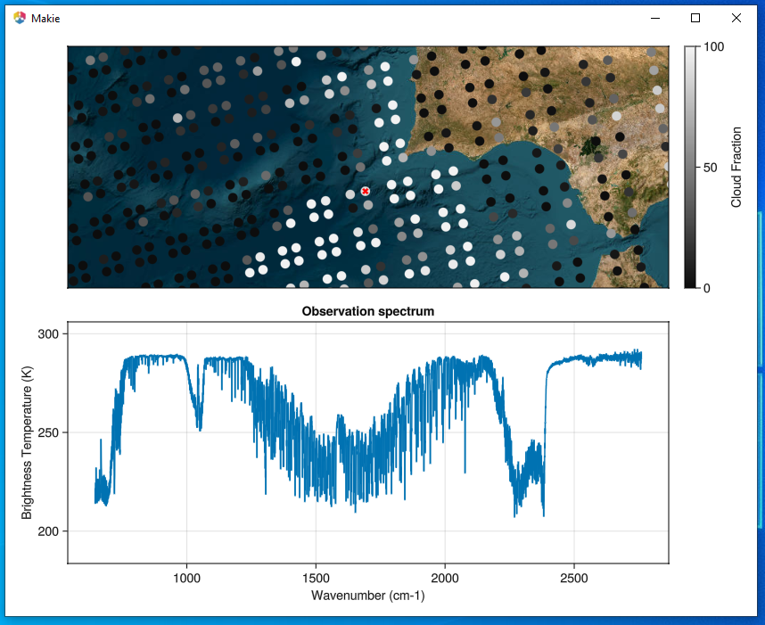
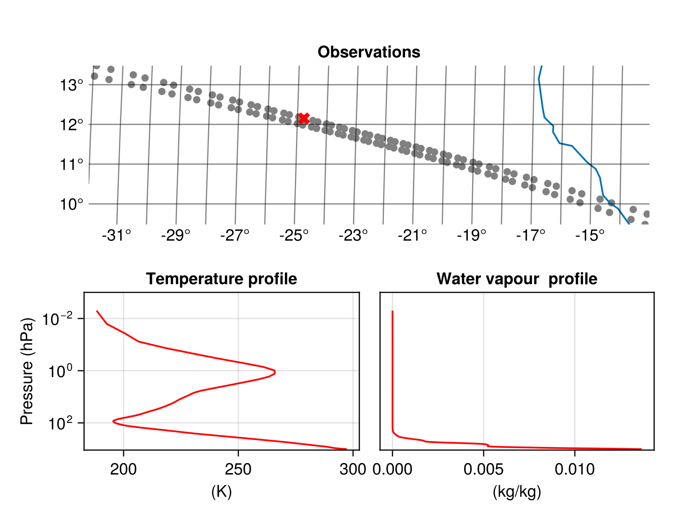

## IASI

The Infrared Atmospheric Sounding Interferometer (IASI) is an instrument on the METOP satellites. It is a hyper-spectral infrared sensor measuring upwelling radiation from a sun-synchronous orbit in 8461 spectral channels (645.0 - 2760.0 cm-1). These measurements are used to derive a plethora of geophysical variables (e.g. temperature and humidity profiles). This makes IASI a key data source for numerical weather prediction (NWP) and applications in atmospheric chemistry and monitoring of essential climate variables.
See [IASI Level 1: Product Guide](https://user.eumetsat.int/s3/eup-strapi-media/pdf_iasi_pg_487c765315.pdf) and [IASI Level 2: Product Guide](https://user.eumetsat.int/s3/eup-strapi-media/IASI_Level_2_Product_Guide_8f61a2369f.pdf) for more information.


## Static plot of L1C spectra
This example is made using the following packages.
```
[13f3f980] CairoMakie v0.12.16
[db073c08] GeoMakie v0.7.9
```

The key variable is "gs1cspect" which contains the radiance spectra measured by IASI. The spectra from a full orbit are almost 2 GB of data. In this example we will just load one data record with observation locations and plot the spectra of two observations. The spectra are converted from radiances to brightness temperature since this is often convenient when interpreting the IASI spectra. The cloud cover in each individual field of view (from AVHRR) is also read from the file and included as legends on the plot of the spectra.  

```julia
using MetopDatasets
using CairoMakie, GeoMakie

ds = MetopDataset("IASI_xxx_1C_M01_20240925202059Z_20240925220258Z_N_O_20240925211316Z.nat", maskingvalue=NaN);

# Select a single data record
data_record_index = 670

# Select 2 points to plot the full spectrum 
selected_points = CartesianIndex.([(2,15), (1,27)])
selected_colors = [:red, :black]

# Read the geolocation of the data record
longitude, latitude = let 
    lon_lat = ds["ggeosondloc"][:,:,:,data_record_index]
    lon_lat[1,:,:], lon_lat[2,:,:]
end

# read spectrum as brightness temperature
wavenumber = ds["spectra_wavenumber"][:, data_record_index]
selected_T_b = let 
    spectra = ds["gs1cspect"][:,:,:,data_record_index]
    # convert select spectra to brightness temperature
    [brightness_temperature.(spectra[:,i] , wavenumber) 
        for i in selected_points]
end

# Read cloud cover for the selected points
selected_cloud_cover = ds["geumavhrr1bcldfrac"][:,:,data_record_index][selected_points]

# plot the data
fig = let

    fig = Figure()

    # axis to plot geolocation
    ax = GeoAxis(fig[1, 1],
        title = "Observations",
        xlabel = "longitude",
        ylabel = "latitude",
        limits = (extrema(longitude), extrema(latitude)))

    # plot all observations from data record in gray
    scatter!(ax, longitude[:], latitude[:], color=:gray)
    # plot selected observations in color
    scatter!(ax, longitude[selected_points], latitude[selected_points], 
        color=selected_colors, marker=:xcross, markersize = 15)

    # Add coastlines
    lines!(ax, GeoMakie.coastlines()) 

    # Plot the selected spectra
    ax2 = Axis(fig[2, 1],
        title = "Selected spectra",
        xlabel = "Wavenumber (cm-1)",
        ylabel = "Brightness Temperature (K)",
        limits=((500,3500), (150,300)))

    for i in eachindex(selected_points)
        cloud_cover_i = Int(selected_cloud_cover[i])
        lines!(ax2, wavenumber./100, selected_T_b[i], color = selected_colors[i],
            label = "$(cloud_cover_i)% cloud cover")
    end

    # Add legends
    axislegend(ax2, position = :rb)

    fig
end
```

The top plot shows a row of observations west of the French coast. Two observation have been marked with a colored X. The spectrum of these observations are shown below.


## Advanced interactive plots of L1C spectra
This example shows how the IASI spectra can be shown interactively on a responsive map. The example relies on [Tyler.jl](https://makieorg.github.io/Tyler.jl/v0.2.0/) and [GLMakie.jl](https://docs.makie.org/stable/explanations/backends/glmakie#glmakie). It is recommend to first try some examples from the Tyler documentation if you are new to this package. 
```
[e9467ef8] GLMakie v0.10.16
[e170d443] Tyler v0.2.0
```
This example will use Tyler to create an interactive background map similar to google maps in the top panel of the figure. Then all the locations of the observation will be plotted on the map colored based on the cloud cover. The bottom panel will display the spectrum of a single observation. Clicking an observation in the top panel will load that spectrum and plot it in the bottom panel. The loading of the spectrum will be done lazily to conserve memory.
```julia
using Tyler, GLMakie, MetopDatasets

ds = MetopDataset("IASI_xxx_1C_M01_20240925202059Z_20240925220258Z_N_O_20240925211316Z.nat", maskingvalue=NaN);

# read geolocation points and data shape
pts, pts_original_size = let
    lon_lat = ds["ggeosondloc"][:,:,:,:]

    # make sure longitude is from -180 to 180
    lon_lat[1, :,:,:][ lon_lat[1,:,:,:] .>180] .-= 360

    # convert the points to tuples
    lon_lat = tuple.(lon_lat[1, :,:,:],lon_lat[2, :,:,:])

    # store the original shape of the points
    pts_original_size = size(lon_lat)

    # Flatten the points and convert them to web_mercator (the coordinate system used by Tyler)
    MT = Tyler.MapTiles
    pts = [Point2f(MT.project(lon_lat[i], MT.wgs84, MT.web_mercator)) 
            for i in eachindex(lon_lat)]
    
    pts, pts_original_size
end;

# read cloud fraction
cloud_fraction = Float32.(ds["geumavhrr1bcldfrac"][:]);

# helper function to read the spectrum for a single point
function read_spectrum_pts(ds, index::CartesianIndex)
    # read spectrum and wavenumber
    spectrum = ds["gs1cspect"][:,Tuple(index)...]
    wavenumber = ds["spectra_wavenumber"][:, Tuple(index)[end]]

    # covert to brightness temperature
    T_B = brightness_temperature.(spectrum, wavenumber)
    wavenumber_cm = wavenumber./100

    # join brightness temperature and wavenumber to points
    spectrum_pts = Point2f.(tuple.(wavenumber_cm, T_B))
    return spectrum_pts
end

# read an initial spectrum
spectrum_pts = read_spectrum_pts(ds, CartesianIndex(1,1,1));

# create the inter active plot.
fig = let
    fig = Figure()
    
    # select background map and initial zoom
    provider = Tyler.TileProviders.Esri(:WorldImagery);
    extent = Tyler.Extent(X = (-10, 10), Y = (-10, 10));

    # create background map
    ax1 = Axis(fig[1,1])
    m = Tyler.Map(extent; provider, figure=fig, axis=ax1);
    wait(m);

    # Plot observation points with cloud cover
    objscatter = scatter!(ax1, pts, color = cloud_fraction, 
        colorrange = (0,100), colormap=:grays, markersize=15)
    # hack from https://github.com/MakieOrg/Tyler.jl/issues/109
    translate!(objscatter, 0, 0, 10) 

    # Plot a red cross on top of the selected point
    selected_point = Observable(pts[1:1])
    selected_scatter = scatter!(ax1, selected_point, 
        color = :red, markersize=10, marker =:xcross)
    # hack from https://github.com/MakieOrg/Tyler.jl/issues/109
    translate!(selected_scatter, 0, 0, 11)

    # Add colorbar
    Colorbar(fig[1, 2], limits = (0.0,100.0), colormap =:grays, label = "Cloud Fraction")
    hidedecorations!(ax1)

    # Create the second plot for the spectrum
    ax2 = Axis(fig[2, 1],
        title = "Observation spectrum",
        xlabel = "Wavenumber (cm-1)",
        ylabel = "Brightness Temperature (K)")

    # plot the spectrum
    spectrum_observable = Observable(spectrum_pts)
    lines!(ax2, spectrum_observable)
    
    # Add event handler to update the plot when the user click on a new observation 
    obs_func = on(events(m.axis).mousebutton) do event
        if event.button == Mouse.left && event.action == Mouse.press
            plt, i = pick(m.axis)
            if plt == objscatter # check if an observation was clicked
                # get the CartesianIndex
                cartesian_i = CartesianIndices(pts_original_size)[i]
                # load the selected spectrum and update the spectrum plot
                spectrum_observable[] = read_spectrum_pts(ds, cartesian_i)
                # update the red x
                selected_point[] = pts[i:i]
            end
        end
    end

    fig
end
```

It is now possible to interactively explore the nearly 100 000 observations from an obit of IASI with the background map giving important context. 

## Level 2 Combined Sounding Products 
The IASI level 2 products contains derived atmospheric profiles of temperature, water vapour, ozone and trace gases. The availability of these profiles depend on cloud cover and therefore the number of profiles will vary through out the product. These variables of changing size are padded with fill values (default to `missing`) to generate an array that fits with the `MetopDataset` interface. This example plots the temperature and water vapour profiles next to a map showing the location of the observation. The example uses `maskingvalue = NaN` for selected variables to avoid `missing` values. We read the "first guess" variables (fg\_atmospheric\_water\_vapour, fg\_atmospheric\_temperature), because they contain the data from the statistical all-sky retrieval. The 1DVar algorithm that generates the "non-first guess" profiles will be phased out in favor of the statistical retrieval in the future.

```julia
using MetopDatasets
using CairoMakie, GeoMakie

ds = MetopDataset("IASI_SND_02_M03_20250120105357Z_20250120123253Z_N_O_20250120123416Z.nat");

# Select color to plot temperature and humidity profile
selected_color = :red

# Select a single data record
data_record_index = 105

# Read temperature and humidity profiles;
# we read the profiles from the statistical retrieval with associated quality indicators
temperature, humidity, selected_point  = let
    temp_var = cfvariable(ds, "fg_atmospheric_temperature", maskingvalue = NaN)
    qi_temp_var = cfvariable(ds, "fg_qi_atmospheric_temperature", maskingvalue = NaN)
    humidity_var = cfvariable(ds, "fg_atmospheric_water_vapour", maskingvalue = NaN)
    qi_humidity_var = cfvariable(ds, "fg_qi_atmospheric_water_vapour", maskingvalue = NaN)
    # keep only soundings where the quality indicators are low
    # thresholds can be relaxed to increase data yield
    # only look at selected data_record_index to save time
    good_retrievals = findall(qi_temp_var[:,data_record_index] .< 2 
                               .&& qi_humidity_var[:,data_record_index] .< 4)
    # we select the 60th retrieval for plotting
    selected_point = good_retrievals[60]
    
    temp_var[:, selected_point, data_record_index], 
    humidity_var[:, selected_point, data_record_index], selected_point
end

# Read the geolocation of the data record
longitude, latitude = let 
    lat_lon_var = cfvariable(ds, "earth_location", maskingvalue = NaN)
    lat_lon = ds["earth_location"][:,:,data_record_index]
    lat_lon[2,:], lat_lon[1,:]
end

# Read the pressure levels 
temp_pressure_levels, hum_pressure_levels = let 
    giard = MetopDatasets.read_first_record(ds, MetopDatasets.GIADR_IASI_SND_02_V11)
    
    scale_factor_temp = MetopDatasets.get_scale_factor(MetopDatasets.GIADR_IASI_SND_02_V11, :pressure_levels_temp)
    temp_level = giard.pressure_levels_temp/10^scale_factor_temp

    scale_factor_humidity = MetopDatasets.get_scale_factor(MetopDatasets.GIADR_IASI_SND_02_V11, :pressure_levels_humidity)
    humidity_level = giard.pressure_levels_humidity/10^scale_factor_humidity

    temp_level, humidity_level
end

# Plot figure
fig = let

    fig = Figure()

    # axis to plot geolocation
    ax = GeoAxis(fig[1, 1:2],
        title = "Observations",
        xlabel = "longitude",
        ylabel = "latitude",
        limits = (extrema(longitude), extrema(latitude)))

    # plot all observations from data record in gray
    scatter!(ax, longitude[:], latitude[:], color=:gray)
    # plot selected observations in color
    scatter!(ax, longitude[[selected_point]], latitude[[selected_point]], 
        color=[selected_color], marker=:xcross, markersize = 15)

    # Add coastlines
    lines!(ax, GeoMakie.coastlines()) 

    # Plot the temperature profile 
    y_limits = (0.001,1900.0)

    ax2 = Axis(fig[2, 1],
        title = "Temperature profile",
        ylabel = "Pressure (hPa)",
        xlabel = "(K)", yreversed = true,
        limits = (nothing, y_limits),
	yscale= log10)

    lines!(ax2,  temperature, temp_pressure_levels/100, color = selected_color)
    
    # Plot the temperature profile 
    ax3 = Axis(fig[2, 2],
        title = "Water vapour  profile",
        ylabel = "Pressure (hPa)",
        xlabel = "(kg/kg)", yreversed = true,
        limits = (nothing, y_limits),
	yscale = log10)

    lines!(ax3,  humidity, hum_pressure_levels/100, color = selected_color)
    hideydecorations!(ax3, grid=false)

    fig
end
```

The top plot shows a row of observations west of the west African coast. One observation has been marked with a colored X. The corresponding temperature and water vapour profile of the observation are shown below.
